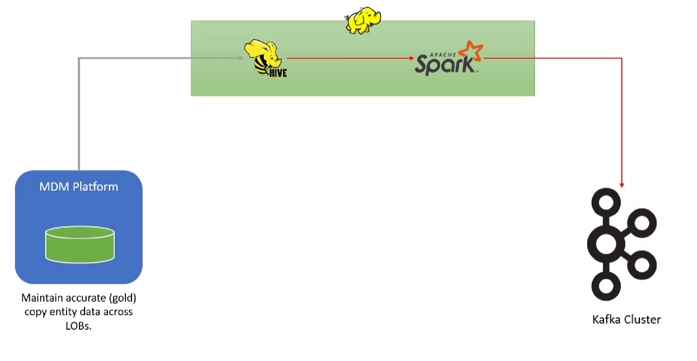

##SBDL : Spark Bulk Data Load

##Add the below line in spark-3.2.1\conf\spark-defaults.conf file

spark.driver.extraJavaOptions -Dlog4j.configuration=file:log4j.properties -Dspark.yarn.app.container.log.dir=app-logs -Dlogfile.name=hello-spark

##Project Architeture
Retrieves data from Hive tables, performs necessary transformations, and efficiently writes the processed data to Kafka.

